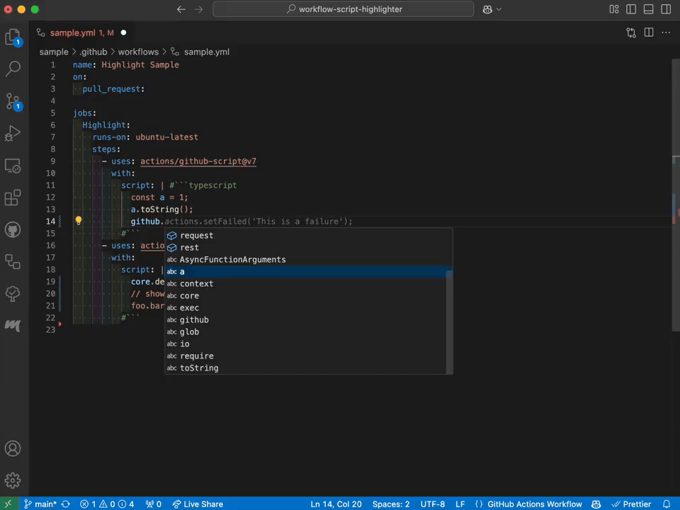
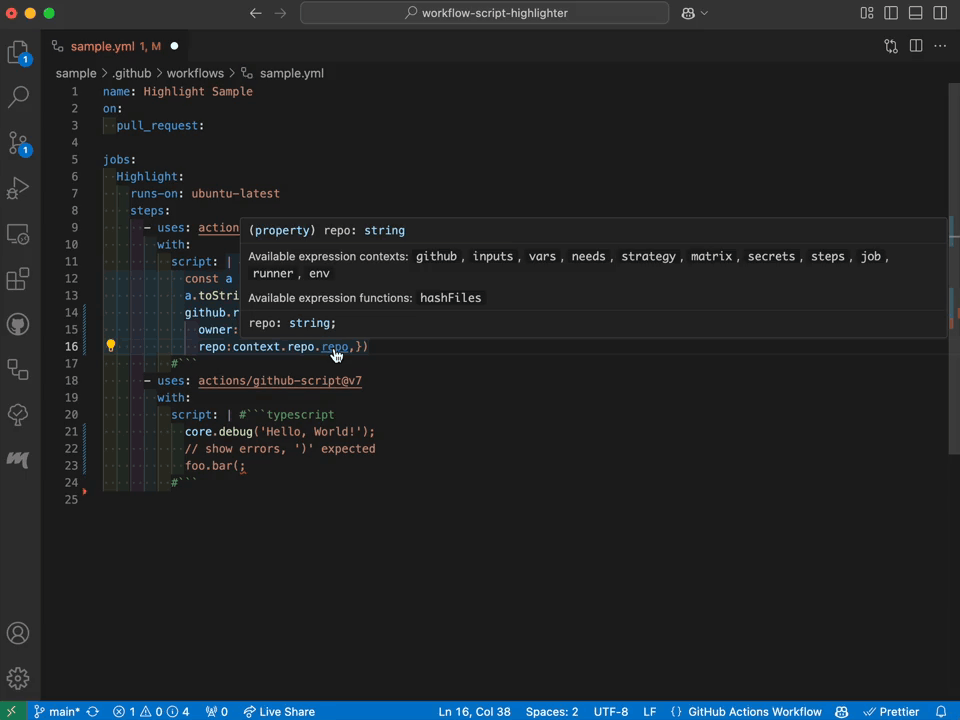

# Workflow Script Highlighter

This extension highlights the TypeScript syntax of the @actions/github-script scripts section in the VS Code editor.
Also, it provides a code completion feature.

## Features

- Highlight the TypeScript syntax of the @actions/github-script scripts section.

<!-- For GitHub -->
https://github.com/user-attachments/assets/3bdfbb3d-7c47-411e-9cb4-383285e5b490

<!-- For Marketplace -->
<!--  -->

<!-- For GitHub -->
https://github.com/user-attachments/assets/9b227403-327f-4f94-a70b-5505f05f966f

<!-- For Marketplace -->
<!--  -->

Powered by Volar.js

## Requirements

- [GitHub Actions Extension](https://marketplace.visualstudio.com/items?itemName=GitHub.vscode-github-actions)

## Contributing

NEED HELP, See Issues.
