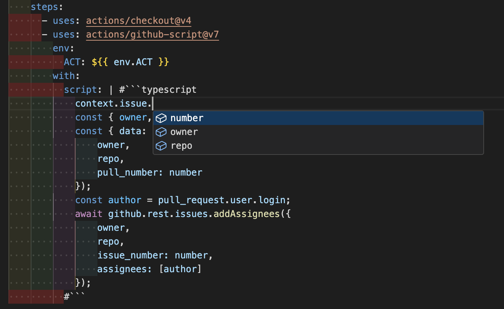

# Workflow Script Highlighter

This extension highlights the TypeScript syntax of the @actions/github-script scripts section in the VS Code editor.
Also, it provides a code completion feature.

## Features

- Highlight the TypeScript syntax of the @actions/github-script scripts section.

## Requirements

- [GitHub Actions Extension](https://marketplace.visualstudio.com/items?itemName=GitHub.vscode-github-actions)

## Contributing

NEED HELP, See Issues.
